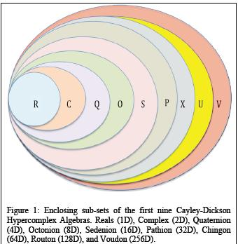

# hypercomplex

[](https://travis-ci.com/ogeagla/clj-hypercomplex)

[](https://clojars.org/hypercomplex)

```clojure
[hypercomplex "0.0.1"]
```

A hypercomplex number library written in Clojure.

Includes Cayley-Dickson construction for generating and working with hypercomplex algebras.

https://en.wikipedia.org/wiki/Cayley%E2%80%93Dickson_construction



## Usage

Here's an example of using `hypercomplex` to demonstrate that the quaternions are associative for some fixed values:

```clojure
(:require [hypercomplex.core :refer :all]
          [hypercomplex.cayley-dickson-construction :refer
            [complex quaternion octonion sedenion pathion]])

(is
  (= (times
       (quaternion {:a 1 :b 2 :c 3 :d 4})
       (times (quaternion {:a 8 :b 7 :c 6 :d 5})
              (quaternion {:a 9 :b 10 :c 11 :d 12})))
     (times
       (times
         (quaternion {:a 1 :b 2 :c 3 :d 4})
         (quaternion {:a 8 :b 7 :c 6 :d 5}))
       (quaternion {:a 9 :b 10 :c 11 :d 12}))))
```
In addition to `times` there is also `plus`, `minus`, `neg`, and `c` (conjugate).

Or, you can use operations on the algebras like `scale`, `norm`, `inv`, or `mag` like so:
```clojure
(is 
  (= (quaternion {:a 1.5 :b 1.5 :c 1.5 :d 1.5})
     (scale 
       (quaternion {:a 1 :b 1 :c 1 :d 1})
       1.5)))
       
(is (= 32
       (norm (pathion {:a 1 :b 1 :c 1 :d 1 :e 1 :f 1 :g 1 :h 1
                       :i 1 :j 1 :k 1 :l 1 :m 1 :n 1 :o 1 :p 1
                       :q 1 :r 1 :s 1 :t 1 :u 1 :v 1 :w 1 :x 1
                       :y 1 :z 1 :aa 1 :bb 1 :cc 1 :dd 1 :ee 1 :ff 1}))))       
```

In addition to `quaternion`, this library also provides built-in support to construct `complex`, `octonion`, and `sedenion` algebras, with easy extensibility for higher order algebras.

## Tests

```bash
lein test
```

## License

Credits to:
  - https://github.com/hamiltron/py-cayleydickson (MIT License)
  - https://nakkaya.com/2009/09/29/fractals-in-clojure-mandelbrot-fractal/
  - https://github.com/clojure-numerics/image-matrix/blob/master/src/main/clojure/mikera/image_matrix/colours.clj (EPL License)

Copyright © 2018 FIXME

Distributed under the Eclipse Public License either version 1.0 or (at
your option) any later version.
